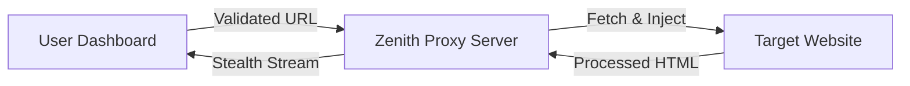

# Zenith 🚀

[](https://opensource.org/licenses/MIT)
[](https://reactjs.org/)
[](https://zenith.proxy)

**Secure, Stealth, and Unstoppable.**

Zenith is a high-performance web proxy designed to provide a truly undetectable browsing experience. It combines a premium, minimalist dashboard with a sophisticated injection proxy that neutralizes common web-based activity monitoring.

---

## 🏗️ Architecture

Zenith operates on a dual-layer architecture designed for maximum stealth:

1.  **Dashboard (Client)**: A React-based, fully responsive interface featuring fluid typography and monochrome aesthetics. It provides a secure gateway for launching proxy sessions.
2.  **Injection Proxy (Server)**: A Node.js backend that fetches target sites, strips security headers, and injects the **Zenith Stealth Engine**.



---

## 🧠 Technical Deep Dive: The Stealth Engine

Zenith is uniquely effective because it fundamentally alters how the browser reports page activity.

### 1. Neutralizing Visibility API

Most monitoring tools use `document.hidden` and `document.visibilityState` to detect tab switching. Zenith overrides these properties at the core level:

```javascript
Object.defineProperty(document, "hidden", {
  value: false,
  configurable: false,
});
Object.defineProperty(document, "visibilityState", {
  value: "visible",
  configurable: false,
});
```

### 2. Event Hijacking

Zenith intercepts calls to `addEventListener` to block specific detection events like `blur`, `focus`, and `visibilitychange` before they can be registered by the target site.

### 3. Header Stripping

The proxy server automatically removes security headers that prevent framing and cross-site scripting:

- `X-Frame-Options`
- `Content-Security-Policy (CSP)`
- `Strict-Transport-Security (HSTS)`

---

## 🌟 Premium Features

- **🎨 Monochrome Aesthetics**: A sleek, premium UI built with a strict gray, black, and cream white palette.
- **📱 Full Responsiveness**: Optimized for every device size, using fluid `clamp()` typography and adaptive grids.
- **✅ Smart URL Validation**: Robust client-side validation logic that ensures only clean, correctly formatted URLs are processed.
- **📲 PWA Support**: Can be installed as a standalone app on desktop and mobile.

---

## 🚀 Getting Started

### Installation

1.  **Clone the repository**:

    ```bash
    git clone <repository-url>
    cd bypass
    ```

2.  **Install & Run Backend**:

    ```bash
    cd server && npm install && node index.js
    ```

3.  **Install & Run Frontend**:
    ```bash
    cd client && npm install && npm run dev
    ```

---

## ⚠️ Disclaimer

This tool is for **educational and research purposes only**. The authors are not responsible for any misuse. Always respect the Terms of Service of the websites you visit.

---

## 📜 License

Distributed under the MIT License.
